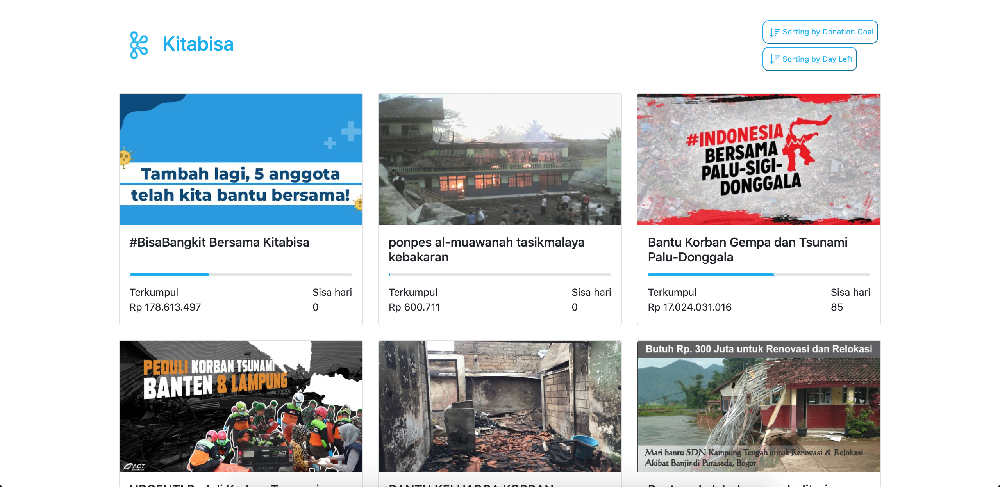

# Kitabisa Campaign

## Stack

* React
* Parcel-bundler
* npm
* Redux
* Redux-thunk
* Axios
* Bootstrap CDN

## To get the frontend running locally:

- `Clone this repo`
- `Install`

```shell
npm install
```

## Run

### Run local server

This command was created because fetching could not be done directly to the API server because it is CORS. so it's need to run local server. Please open a second terminal to run commands.
```shell
npm run server
```

### Run app
```shell
npm start start
```

## Functionality overview

The Kitabisa campaign is a social blogging site (i.e. a Kitabisa.com clone). This React application is built with its own bundler with parcels.

**General functionality:**

- GET and display card lists of campaign
- Button sorting by donation goal and day left

**Preview:**

